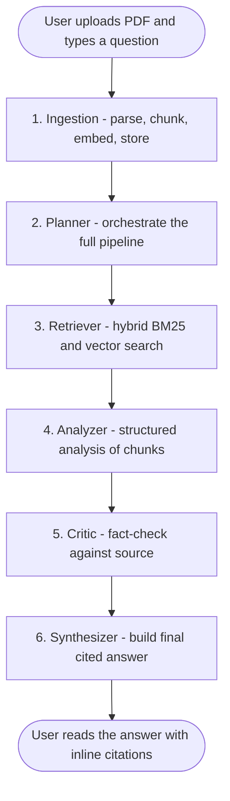

# SciAgent

[](https://github.com/VANDRANKI/sciagent-frontend/actions/workflows/build.yml)

SciAgent, a research paper question-answering system powered by a multi-agent AI pipeline.

---

## What It Does

Upload a research paper (PDF) and ask any question about it. Six AI agents work in sequence to retrieve relevant sections, analyze them, fact-check the analysis, and produce a fully cited answer.

---

## Project Structure

```
sciagent-frontend/
    app/
        page.tsx              
        layout.tsx            
        globals.css           
        api/analyze/route.ts  
    components/
        FileUpload.tsx        
        AgentPipeline.tsx      
        ChatDisplay.tsx       
        CavemanLoader.tsx     
        LoadingSteps.tsx      
    lib/
        types.ts             
        api.ts        
```

---

## Setup

1. Install dependencies:

```bash
npm install
```

2. Create `.env.local` from the example:

```bash
cp .env.local.example .env.local
```

3. Set the backend URL in `.env.local`:

```
HF_SPACE_URL=https://your-hf-space.hf.space
```

4. Run the development server:

```bash
npm run dev
```

Open `http://localhost:3000` in your browser.

---

## How It Works


